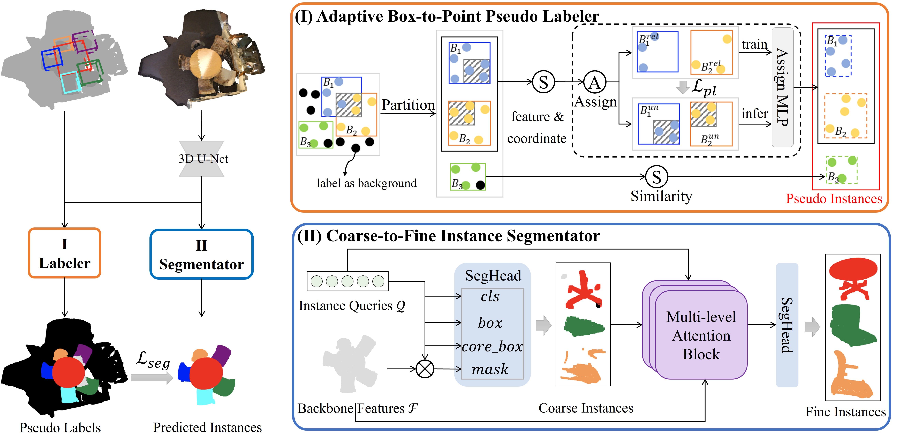

# Sketchy-3DIS
This is the official PyTorch implementation of **Sketchy-3DIS** (Sketchy Bounding-box Supervision for 3D Instance Segmentation (CVPR2025)).

**Sketchy Bounding-box Supervision for 3D Instance Segmentation (CVPR2025)** [\[Paper\]](https://arxiv.org/abs/2505.16399)

Qian Deng, Le Hui, Jin Xie, Jian Yang

<div align="center">
  
</div>

# Get Started

## Environment

Requirements

- Python 3.x
- Pytorch 1.10
- CUDA 10.x or higher

The following installation suppose `python=3.8` `pytorch=1.10` and `cuda=11.3`.

- Create a conda virtual environment

  ```
  conda create -n Sketchy3DIS python=3.8
  conda activate Sketchy3DIS
  ```

- Install the dependencies

  Install [Pytorch 1.10](https://pytorch.org/)

  ```
  pip install spconv-cu113
  conda install pytorch-scatter -c pyg
  pip install -r requirements.txt
  ```

  Install segmentator from this [repo](https://github.com/Karbo123/segmentator).

- Setup, Install spformer and pointgroup_ops.

  ```
  sudo apt-get install libsparsehash-dev
  python setup.py develop
  cd spformer/lib/
  python setup.py develop
  ```

## Data Preparation

### ScanNet v2 dataset

Download the [ScanNet](http://www.scan-net.org/) v2 dataset.

Put the downloaded `scans` and `scans_test` folder as follows.

```
MMImp
├── data
│   ├── scannetv2
│   │   ├── scans
│   │   ├── scans_test
```

Split and preprocess data

```
cd SPFormer/data/scannetv2
bash prepare_data.sh
```

The script data into train/val/test folder and preprocess the data. After running the script the scannet dataset structure should look like below.

```
Sketchy3DIS
├── data
├── dataset
│   ├── scannetv2
│   │   ├── scans
│   │   ├── scans_test
│   │   ├── train
│   │   ├── val
│   │   ├── test
│   │   ├── superpoints
```

## S3DIS dataset

Download the [S3DIS](http://buildingparser.stanford.edu/dataset.html) dataset (`v1.2_Aligned_Version`). 

Download the preprocessed `superpoints` from Box2Mask: [superpoints](https://datasets.d2.mpi-inf.mpg.de/box2mask/segment_labels.tar.gz) and organize as below.

```
Sketchy3DIS
├── dataset
│   ├── s3dis
│   │   ├── Stanford3dDataset_v1.2_Aligned_Version
│   │   │   ├── Area_1
│   │   │   │   ├── hallway_1 
│   │   │   │   │   ├── Annotations # Contains instances information 
│   │   │   │   │   │   ├── door_2.txt 
│   │   │   │   │   │   ├── floor_1.txt
│   │   │   │   │   │   ├── wall_2.txt
│   │   │   │   │   │   ├── ...
│   │   │   │   │   ├── hallway_1.txt # Contains positions and colors of scene points
│   │   │   │   ├── office_1
│   │   │   │   ├── ...
│   │   │   ├── Area_2
│   │   │   ├── Area_3
│   │   │   ├── Area_4
│   │   │   ├── Area_5
│   │   │   ├── Area_6
│   │   ├── learned_superpoin_graph_segmentations
```


Preprocess data

```
cd ISBNet/dataset/s3dis
bash prepare_data.sh
```

After running the script the s3dis dataset structure should look like below.

```
ISBNet
├── dataset
│   ├── s3dis
│   │   ├── Stanford3dDataset_v1.2_Aligned_Version
│   │   ├── learned_superpoin_graph_segmentations
│   │   ├── preprocess
│   │   ├── superpoints
```

### Training
The training steps are the same as the corresponding origin repositories. More details can be referred to [SPFormer](https://github.com/sunjiahao1999/SPFormer), [ISBNet](https://github.com/VinAIResearch/ISBNet).
		
# Acknowledgements
This repo is built upon [SPFormer](https://github.com/sunjiahao1999/SPFormer),[ISBNet](https://github.com/VinAIResearch/ISBNet). 

# Citation
If you find this project useful, please consider citing:

```
@inproceedings{deng2025sketchy,
  title={Sketchy Bounding-box Supervision for 3D Instance Segmentation},
  author={Qian Deng, Le Hui, Jin Xie, Jian Yang},
  booktitle={Proceedings of the IEEE/CVF Conference on Computer Vision and Pattern Recognition},
  year={2025}
}
```